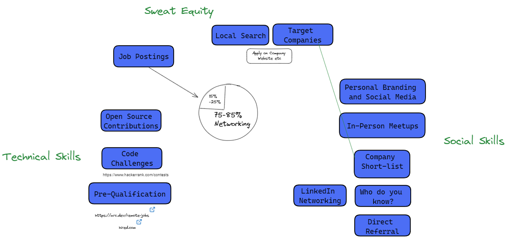

# 404 Job Not Found: Get Unstuck and Land a Software Developer Job
## Tyler Lemke

# A tale of two Devs

Bob vs Michonne

# Bob

# Michonne

# Cover

- Principles
- Strategies
- Artifacts
- Tactics
- Activities/Plans
- Tools
- Feedback

<!-- We often get bogged in the conversation of Tactics and Tools -->

# First principles thinking

What is a job?

So you ultimately job search boils down to:

1. Find people with a need
2. Convince them to hire you

# Principles
## 1. Find People

- Be First
- Be a Friend
- Be Flexible
- Go where other people won't
- Do what others won't

# Principles
## 2. Convince them to hire you

- So Good They Can't Ignore You
- Be Different
- Be the Best

# Principles
## General
- Limited Time
- 80/20 rule
- One Job Only
- Life is a numbers game
- No one thing will land you a job
- Dont Self Filter
- ROI
- Do Fun Stuff

# Three Main Strategies

# Artifacts:

Linkedin Profile
Resume
Portfolio
Github Portfolio
References
Cover Letters

# Skills
## Coding Interview

- Trivia Questions
- Rate Yourself Questions
- Past Experience
- Coding Challenges
- Leetcode Challenges
- Pair Programming Challenge
- Practical Challenge
- Take Homee Chalenges
- Whiteboarding Questions

# Skills
## Social

- Behavioural Questions
- Tell Me About Yourself
- Rapport
- Ice Breaking
- Projecting Confidence

# Skills
## Second Order

- Dealing with Anxiety
- Organized
- On Time
- Interviewing the Company

# Tactics

1. Spam Connecting
2. Informational Interviews
3. Reverse Referral Method

# Tactics
## Spam Connecting (via Linkedin)

1. Identify Groups of People to Connect With
2. Potentially Filter by common background
3. Connect with 20/30 people a day

# Tactics
## Informational Interviews

1. Create Premise for wanting to interview
2. Use Calendly to setup interviews
3. 1st Interview is only 10 min
4. Ask Really great questions
5. Leave on a high note
6. Give NPS Score
7. Follow up with 7s or higher

# Tactics
## Reverse Referral Method

1. After informational interview
2. Tell them you would love to give them a referral bonus

# Activities and Plans
## Activites

# Activities and Plans
## Plans

# Feedback

## Sales Funnel

# Feedback

## Job Funnel

# Tools

## Job Boards

Linkedin
Glassdoor
Google Jobs
Indeed

# Tools

## Other

Job Tracker/Resume Customizer - http://tealhq.com
Job Submission Tool - http://simplify.jobs
Interview Practice - http://pramp.com
Non Big Tech Technical Practice - http://codewars.com
Frontend Quiz/Trivia Prep - https://www.greatfrontend.com/prepare/quiz

# Spam Connect Me

- https://linkedin.com/in/tylerlemke
- https://github.com/tyler-lemke/Get-Your-First-Dev-Job
