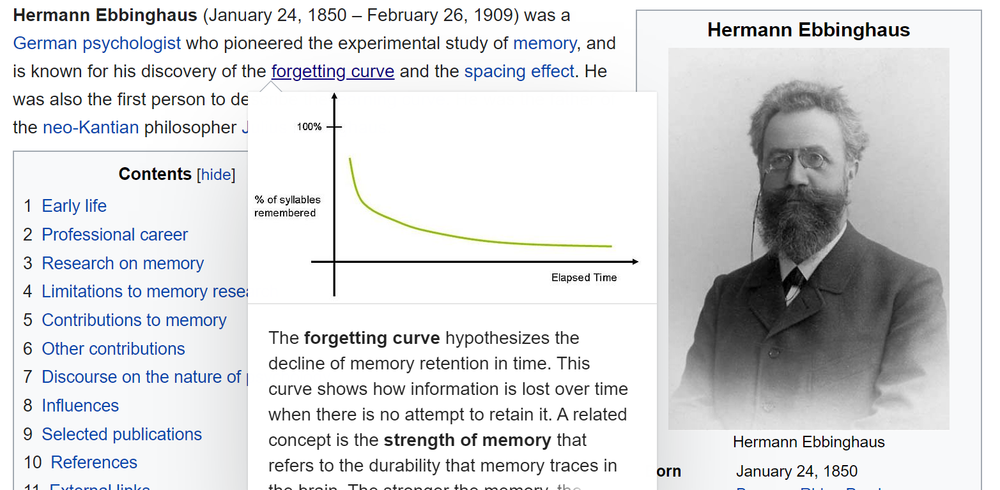
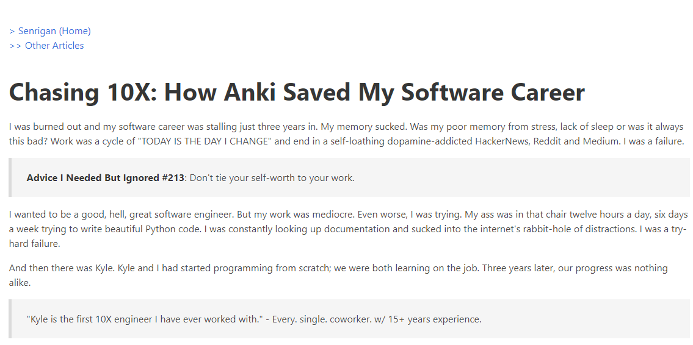
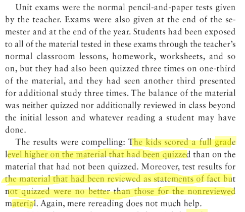

# How To Remember Everything You Learn in QA Automation
## Remember Longer and Waste Less Time
## bit.ly/remember-qa-all

Tyler S. Lemke
juniortoseniordev.com (Podcast)
linkedin.com/in/tylerslemke
bit.ly/youtube-tl

# Tonight's Goal
- Help you think about your education more strategically

# Hermann Ebbinghaus

# A Struggling Dev?

# Pros
- Retaining information
- Removing Cognitive Load
- Making you more productive
- Increasing confidence

# Cons
- Not as effective for learning topics, more for recall
- It takes more effort in the beginning
- It is counterintuitive

# Polling Time
How many of you have re-read text before?

# The counterintuitive truth

# The Results

# Tips
- Focus on the basics first
- Focus on principles
- Master Syntax that Holds You Back
- Use your computer to create Anki Cards
- See Jeff Shek's blog for more

# Tools Needed
- Get Anki on Your Device - https://apps.ankiweb.net/
- Get a habit tracker - 
   - Loop https://play.google.com/store/apps/details?id=org.isoron.uhabits&hl=en_US
   - Habitica https://habitica.com/static/home

# Demo Time

# Resources and Links Used
## Make It Stick, Ultralearning, Tiny Habits, Understanding How We Learn: A Visual Guide, and More Books - https://tylerslemke.com/books/
## Jeff's Blog Post - https://senrigan.io/blog/chasing-10x-leveraging-a-poor-memory-in-software-engineering/
## Jeff's Complete Anki Guide - https://senrigan.io/blog/everything-i-know-strategies-tips-and-tricks-for-spaced-repetition-anki/
## https://www.learningscientists.org/posters